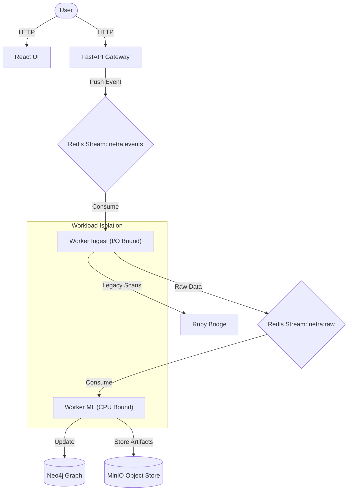

# NETRA v2 - AI-Native Attack Surface Management (ASM) Platform

> **Status**: v2.0 (Migration to Distributed ML Architecture)
> **Stack**: Python 3.10, React + Vite, Neo4j, Redis Streams, MinIO, Docker Compose

NETRA is an **Applied ML Systems** research platform designed to demonstrate advanced concepts in distributed cybersecurity. It continuously discovers assets, maps them in a Knowledge Graph, and uses machine learning to predict risks.

---

##  v2 Architecture: "The ML Systems Approach"

Netra v2 departs from the monolithic scanner model to a distributed, event-driven architecture optimized for High-Throughput I/O and CPU-bound Inference.



### Key Components
1.  **Frontend**: React + Vite + TailwindCSS (Served via Nginx).
2.  **Backend API**: FastAPI (AsyncIO).
3.  **The "Bus"**: Redis Streams for strictly ordered event processing.
4.  **Ingestion Worker**: Lightweight, I/O-bound process for DNS resolution and Port Scanning. Includes a **Ruby Bridge** to execute legacy scripts.
5.  **ML Worker**: Resource-intensive process for False Positive reduction and future model inference.
6.  **Knowledge Graph**: Neo4j stores the "World State" (e.g., `Domain -> RESOLVES_TO -> IP`).

---

## Quick Start (Docker)

Netra v2 is designed to run locally with a single command.

### Prerequisites
- Docker & Docker Compose

### Setup
1.  **Clone & Start**:
    ```bash
    git clone https://github.com/PoojasPatel013/Netra.git
    cd Netra
    docker compose up --build -d
    ```

2.  **Access the Platform**:
    | Service | URL |
    | :--- | :--- |
    | **Netra UI** | [http://localhost:3000](http://localhost:3000) |
    | **API Docs** | [http://localhost:8000/docs](http://localhost:8000/docs) |
    | **Redis Commander** | [http://localhost:8081](http://localhost:8081) |
    | **Neo4j** | [http://localhost:7474](http://localhost:7474) |
    | **MinIO** | [http://localhost:9001](http://localhost:9001) |

---

## Development Workflow

### 1. Trigger a Scan
Use the API (or UI) to push a target into the Ingestion Stream.
```bash
curl -X POST http://localhost:8000/api/scan \
  -H "Content-Type: application/json" \
  -d '{"target": "example.com"}'
```

### 2. Watch it Flow
Open **Redis Commander** (`http://localhost:8081`).
1.  See event appear in `netra:events:ingest`.
2.  Watch `netra-ingest` worker consume it.
3.  See result appear in `netra:data:raw`.
4.  Watch `netra-ml` worker process it.

### 3. Verify Graph
Open **Neo4j** (`http://localhost:7474`) and run:
```cypher
MATCH (n) RETURN n
```
You should see nodes for the Domain and its resolved IPs.

---

## Directory Structure
```
Vortex/
├── deploy/             # Infrastructure scripts
├── netra/
│   ├── api/            # FastAPI Application
│   ├── core/           # Worker Logic
│   │   ├── discovery/  # DNS, Port Scanners
│   │   ├── analysis/   # Ruby Bridge, ML Models
│   │   └── orchestration/ # Redis Messaging
│   ├── ui/             # React Frontend
│   └── workers/        # Worker Entrypoints (ingest.py, ml_analysis.py)
├── docker-compose.yml  # Main Orchestration File
└── README.md
```
## 🤝 Community & Support

We want to build a robust security platform, and we welcome your input!

*   **Discussions**: Have a question or idea? Join the [GitHub Discussions](https://github.com/PoojasPatel013/Netra/discussions).
*   **Wiki**: Check out our [Wiki](https://github.com/PoojasPatel013/Netra/wiki) for detailed architectural docs and guides.
*   **Issues**: Found a bug? Open an Issue!

## 👩‍💻 Contributing

**Netra is Open Source!**

We follow an **Open Core** model:
*   **Netra Core (This Repo)**: Apache 2.0 License. Free for everyone forever.
*   **Netra Boundaries**: Proprietary modules (Advanced ML, SSO, Reporting) will be closed-source extensions.

We actively encourage contributions to the Core engine!
1.  **Bug Reports**: Found a vulnerability in the scanner? Fix it!
2.  **New Scanners**: Add Python/Ruby modules for new CVEs.
3.  **Docs**: Improve the Wiki.

Please read our `CONTRIBUTING.md` for our Code of Conduct.

## 📜 License

**Open Source (Apache 2.0)**

The Core Engine is free to use and modify under the Apache 2.0 License. See [LICENSE.md](LICENSE.md).

*Proprietary Boundaries will be licensed separately.*

Copyright © 2025 Netra.
